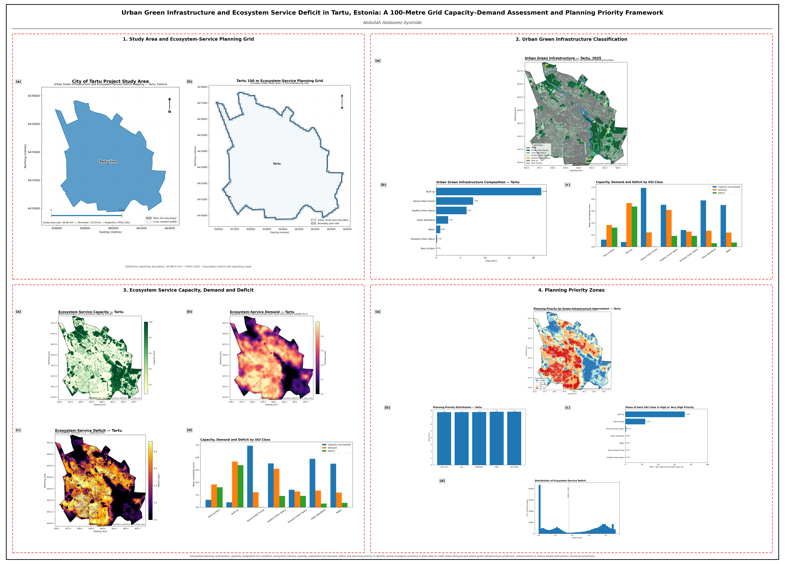
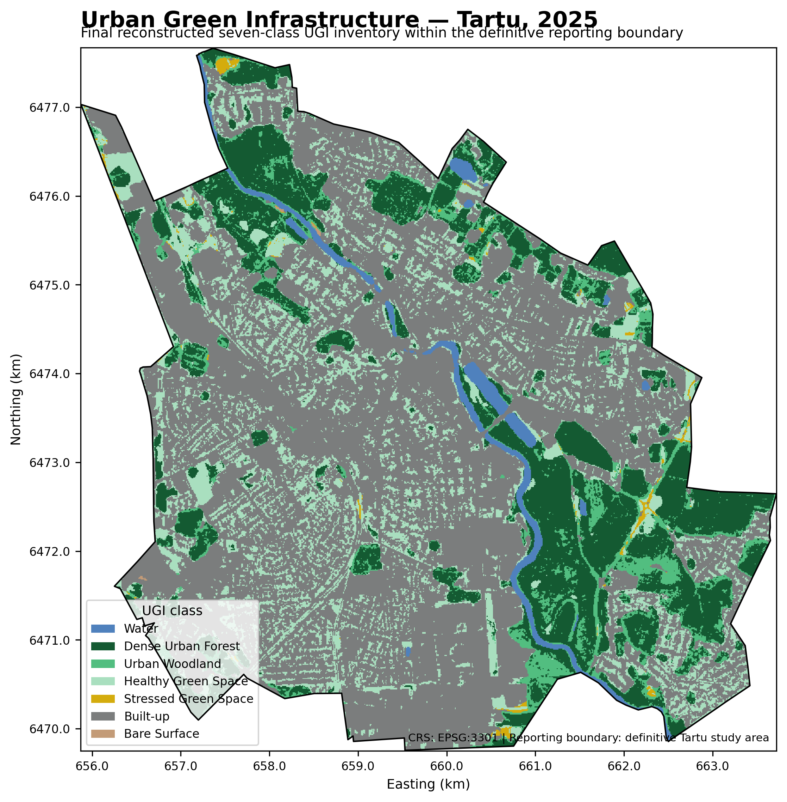
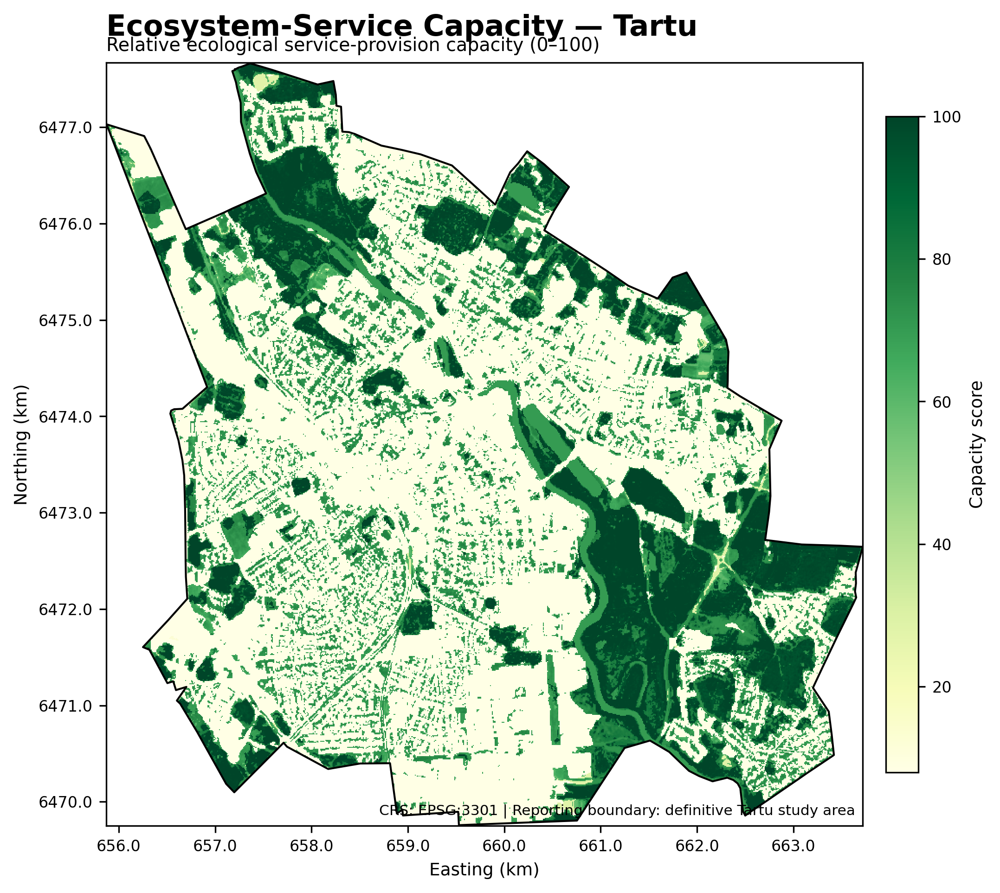
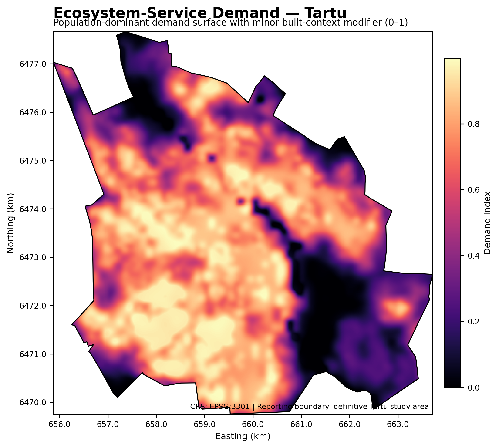
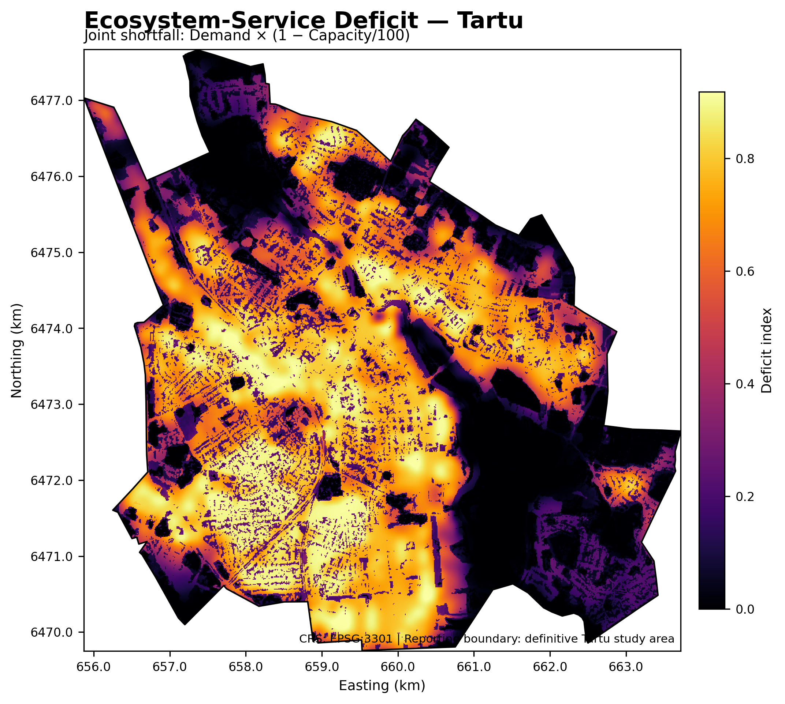
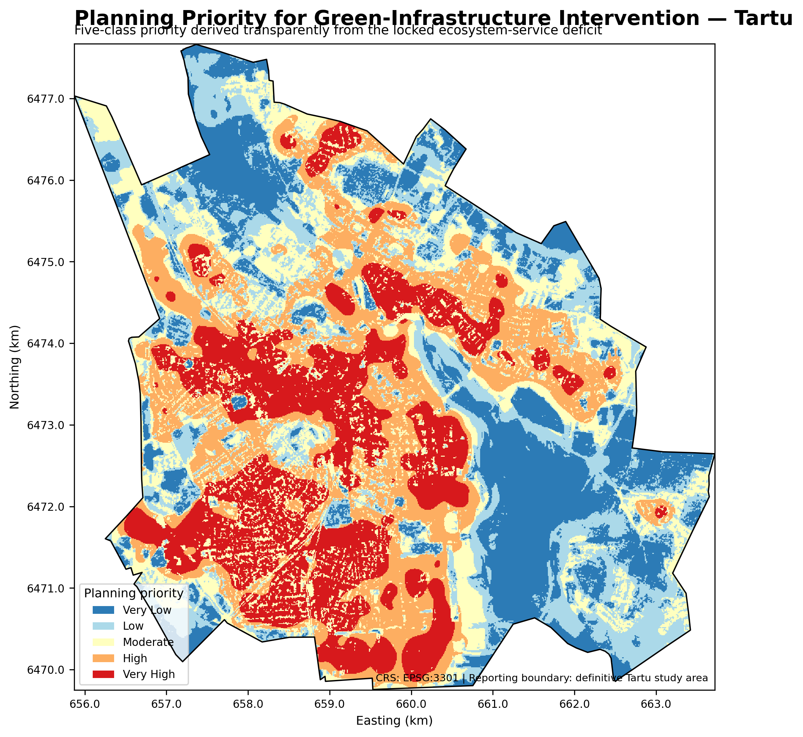
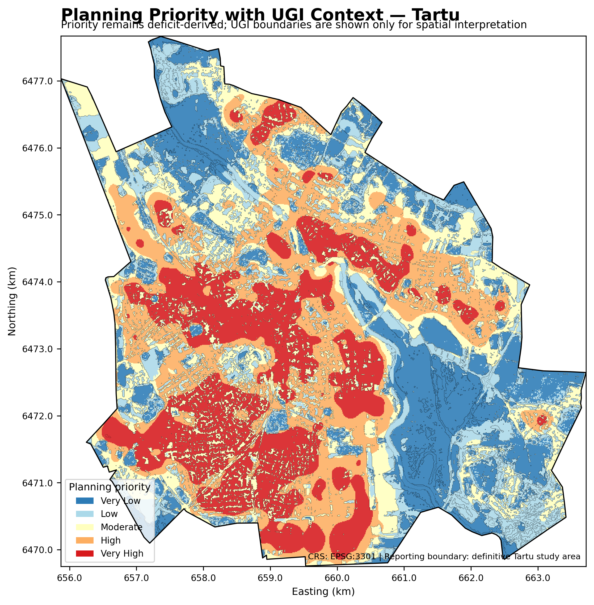

# Urban Green Infrastructure and Ecosystem Service Deficit Mapping — Tartu, Estonia

**A geospatial planning assessment of ecosystem-service capacity, demand, deficit and intervention priorities across Tartu.**

<p align="center">
  
</p>

## Overview

Urban green infrastructure supports cooling, stormwater regulation, biodiversity, recreation and general environmental quality, but green assets are not always located where urban demand is strongest. I developed this project to identify that spatial mismatch across Tartu, Estonia, and translate it into practical planning priorities.

The analysis integrates Sentinel-2 vegetation and surface-condition indicators, Dynamic World land-cover information and WorldPop population data. I used these inputs to classify urban green infrastructure, estimate ecosystem-service capacity, model population-led demand, calculate ecosystem-service deficit and identify areas where green-infrastructure intervention should receive greater planning attention.

**Research question:** *Where are ecosystem-service deficits concentrated in Tartu, and which areas should receive the greatest planning attention for urban green-infrastructure intervention?*

## Study area

| Project detail | Final value |
|---|---:|
| Study area | Tartu, Estonia |
| Reporting area | **38.8872 km²** |
| CRS | **EPSG:3301** |
| Analytical resolution | **10 m** |
| Reporting pixels | **388,872** |

## Methodology

1. Prepared the Tartu study boundary and a common 10 m analytical grid.
2. Derived NDVI, EVI, NDMI, NDBI, MNDWI, SAVI and BSI from Sentinel-2 imagery.
3. Integrated spectral condition with Dynamic World to classify seven urban land/UGI classes.
4. Estimated ecosystem-service capacity on a 0–100 relative scale from UGI class and vegetation condition.
5. Modelled ecosystem-service demand using WorldPop as the dominant signal (85%) and built context as a smaller modifier (15%).
6. Calculated deficit as **Demand × (1 − Capacity/100)**.
7. Ranked the continuous deficit surface into Very Low, Low, Moderate, High and Very High planning-priority classes.
8. Tested the stability of the capacity, demand, deficit and priority patterns under alternative modelling assumptions.
9. Interpreted the resulting spatial patterns and developed planning recommendations.

## Key findings

- Built-up land covers **21.6040 km² (55.56%)** of the reporting area.
- Dense Urban Forest covers **7.5759 km² (19.48%)**.
- Healthy Green Space covers **6.2446 km² (16.06%)**.
- Urban Woodland covers **2.4494 km² (6.30%)**.
- Vegetated UGI classes collectively cover approximately **16.4325 km² (42.26%)**.
- Mean ecosystem-service capacity is **41.54/100**.
- Mean ecosystem-service demand is **0.5768**.
- Mean ecosystem-service deficit is **0.4110**.
- Built-up areas have mean capacity of **8.00/100**, mean demand of **0.7339** and mean deficit of **0.6751**.
- **72.30% of built-up land** falls within High or Very High planning-priority zones.
- High and Very High priority classes together cover approximately **15.6229 km² (40.17%)** of the reporting area.
- Deficit and planning priority have a Spearman correlation of **0.9802**, consistent with priority being derived from the deficit ranking.

## Selected outputs

### Urban Green Infrastructure


### Ecosystem-Service Capacity


### Ecosystem-Service Demand


### Ecosystem-Service Deficit


### Planning Priority


### Planning Priority with UGI Context


## Planning interpretation

The results reveal a clear spatial mismatch between ecological capacity and urban demand. Dense forest and woodland generally provide strong ecosystem-service capacity and experience low deficit, while much of the built-up fabric combines weak local capacity with comparatively high demand. Built-up areas therefore emerge as the main locations for targeted green-infrastructure enhancement—not because the model directly penalises development, but because the combined capacity-demand relationship produces higher deficits there.

The priority map is intended as a strategic screening tool. High-priority locations should be examined for context-appropriate interventions such as street-tree expansion, pocket parks, courtyard greening, green roofs and walls, permeable surfaces, stormwater-oriented green infrastructure and stronger walking connections to existing green assets. Existing high-capacity forest and woodland should be protected from unnecessary fragmentation.


## Data sources

- **Sentinel-2 Surface Reflectance Harmonized** — multispectral imagery used for spectral indicators.
- **Google Dynamic World** — land-cover information used in the UGI classification.
- **WorldPop 2020** — population information used to model spatial ecosystem-service demand.
- **Tartu study boundary** — used to define the final reporting extent.

See [`docs/data_sources.md`](docs/data_sources.md) for details.

## Repository structure

```text
.
├── assets/
│   ├── maps/                 # Six final maps
│   ├── charts/               # Five analytical charts
│   └── project-board/        # Accepted final scientific project board
├── data/processed/
│   ├── tables/               # Final summary tables
│   └── reporting-rasters/    # Final boundary-masked GeoTIFFs
├── docs/                     # Methodology, results, limitations and contribution
├── report/                   # Final public-facing report (DOCX and PDF)
├── CITATION.cff
├── LICENSE
├── README.md
└── project.json
```

## Report

- [Final report — PDF](report/Tartu_UGI_Ecosystem_Service_Deficit_Final_Report.pdf)
- [Final report — DOCX](report/Tartu_UGI_Ecosystem_Service_Deficit_Final_Report.docx)

## Limitations

The capacity, demand and deficit layers are planning-oriented relative indices rather than direct measurements of every ecosystem service. WorldPop is used as a spatial demand proxy rather than household-level population data. The five planning-priority classes are relative to Tartu and should not be transferred directly to another city without recalibration. Site-level intervention design should incorporate field conditions, land ownership, public access, costs, infrastructure constraints and community needs.

## Author

**Abdullah Abdazeez Ayomide**  
Geo-spatial Planner | GIS & Remote Sensing Analyst | Environmental & Urban Planning Researcher

- [GitHub](https://github.com/Abdullahabdazeez)
- [LinkedIn](https://ng.linkedin.com/in/abdazeez-abdullah-4b814719a)

## Citation and licence

Citation metadata is provided in [`CITATION.cff`](CITATION.cff). Code and original documentation are released under the MIT License. External datasets retain their original providers' licences and terms.
