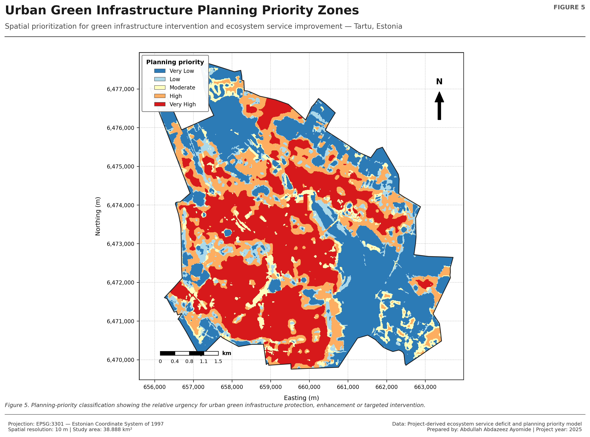
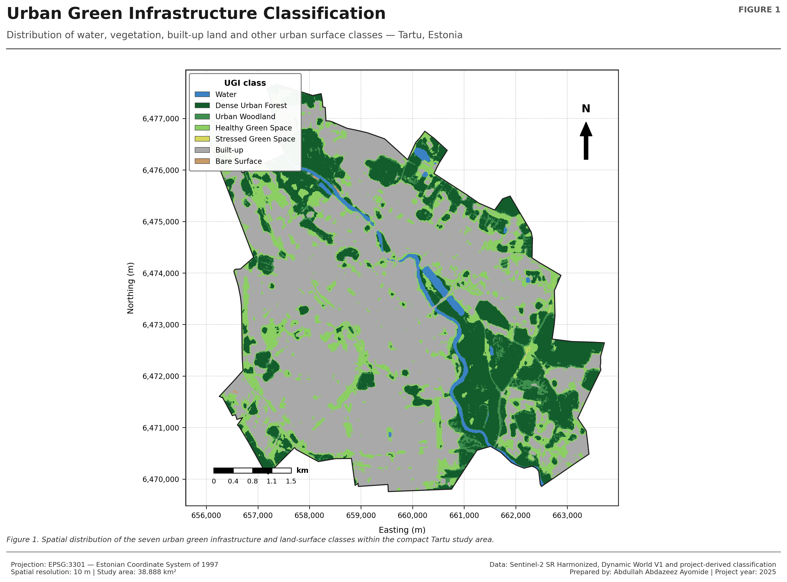
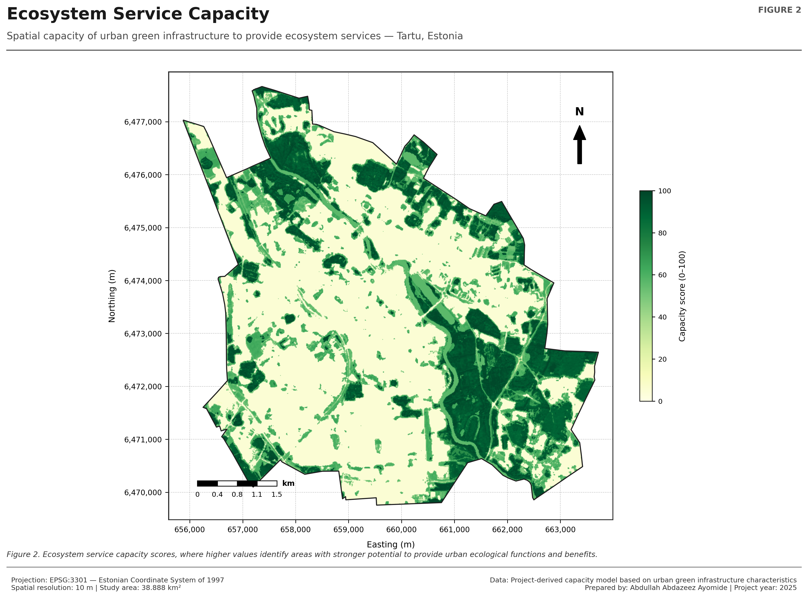
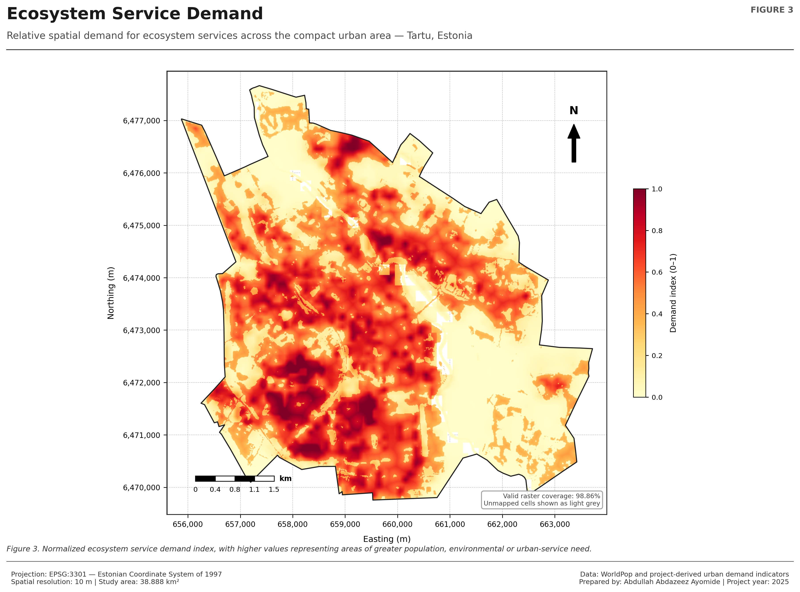
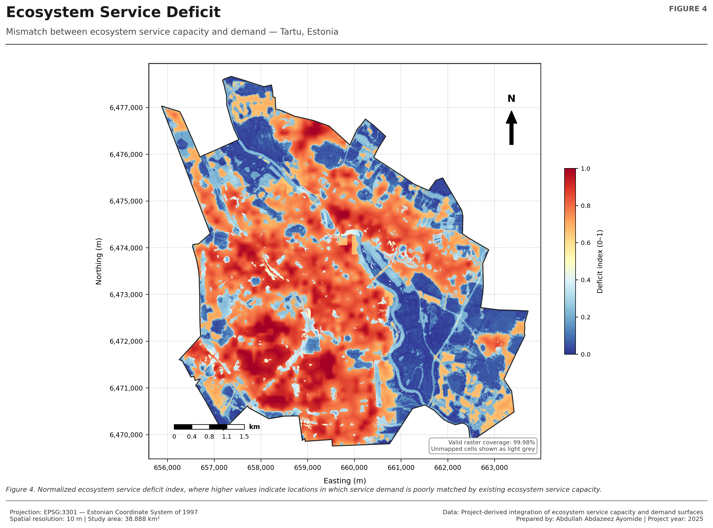
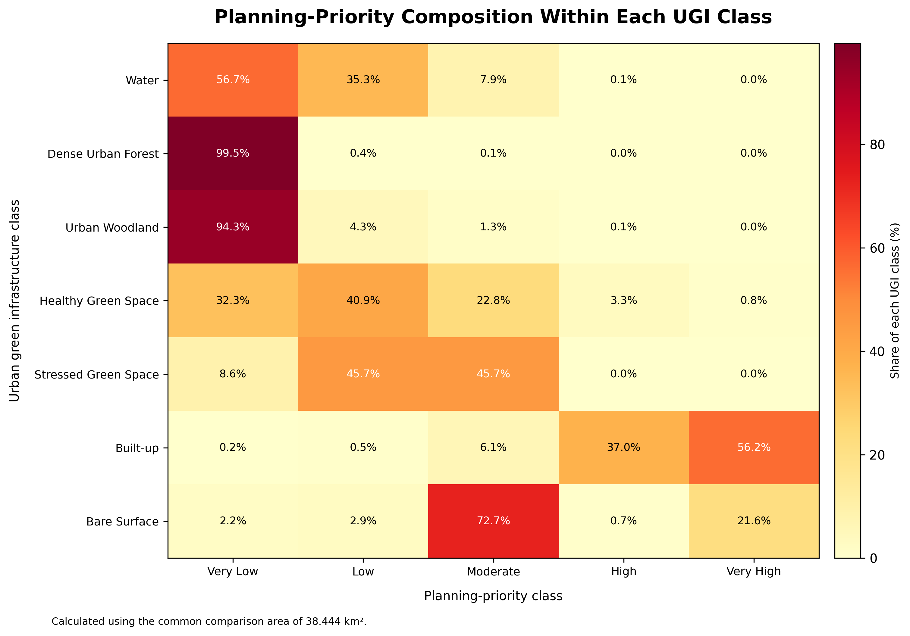

# Urban Green Infrastructure and Ecosystem Service Deficit Mapping — Tartu, Estonia

**A spatial planning assessment of urban green infrastructure, ecosystem-service capacity, demand, deficit and intervention priority across Tartu's compact urban area.**

<p align="center">
  
</p>

Urban green infrastructure supports cooling, runoff regulation, habitat continuity, recreation and other ecosystem services, but its spatial distribution does not always match urban demand. This project developed an integrated planning framework for Tartu, Estonia, combining urban green-infrastructure classes with ecosystem-service capacity, demand and deficit indicators to identify areas requiring intervention.

The authoritative compact urban study area covered **38.89 km²**. Built-up land occupied **55.10%** of the mapped area, while vegetated urban green infrastructure covered **42.74%**. Tree-based UGI—including dense urban forest and urban woodland—covered **25.32%**.

The planning-priority analysis found that **52.02%** of the study area, approximately **20.23 km²**, fell within High or Very High priority classes. Very High priority alone covered **31.09%**, or **12.09 km²**. Built-up areas dominated the highest-priority zones: approximately **19.96 km²**, representing **93.14% of all mapped built-up land**, occurred within High or Very High priority classes.

| Project detail | Information |
|---|---|
| **Study area** | Tartu, Estonia |
| **Compact urban extent** | 38.89 km² |
| **Built-up surface** | 55.10% |
| **Vegetated UGI coverage** | 42.74% |
| **Tree-based UGI coverage** | 25.32% |
| **High + Very High planning priority** | 52.02% |
| **Very High planning priority** | 31.09% |
| **Mean ecosystem-service deficit** | 0.5135 |

## Key findings

- Built-up land covered **21.43 km²** or **55.10%** of the study area.
- Vegetated UGI covered **16.62 km²** or **42.74%**.
- Dense urban forest covered **8.55 km²** or **21.98%**.
- Healthy green space covered **6.76 km²** or **17.38%**.
- High and Very High planning priority covered **20.23 km²** or **52.02%**.
- Very High priority covered **12.09 km²** or **31.09%**.
- **93.14% of mapped built-up land** fell within High or Very High priority zones.
- Mean ecosystem-service capacity was **36.71** on the project's 0–100 scale.
- Mean normalized ecosystem-service demand was **0.3787**.
- Mean ecosystem-service deficit was **0.5135**.
- Mean deficit increased consistently from **0.1038** in Very Low priority areas to **0.8585** in Very High priority areas.

## Analytical framework

1. Prepared the authoritative compact urban boundary and analysis mask.
2. Classified urban green infrastructure into water, dense forest, woodland, healthy green space, stressed green space, built-up and bare-surface classes.
3. Derived ecosystem-service capacity indicators.
4. Estimated normalized ecosystem-service demand.
5. Calculated the spatial mismatch between capacity and demand.
6. Classified ecosystem-service deficit.
7. Combined deficit and planning evidence into five priority classes.
8. Quantified UGI composition within each planning-priority class.
9. Produced planning actions and intervention guidance.

## Selected outputs

### Urban green infrastructure



### Ecosystem-service capacity



### Ecosystem-service demand



### Ecosystem-service deficit



### Planning-priority zones


### UGI and planning-priority relationship



## Planning interpretation

The project identifies where additional green infrastructure, tree-canopy enhancement, ecological restoration or improved green-space connectivity would produce the greatest planning value. High-priority areas are concentrated primarily in built-up zones where ecosystem-service demand is high and existing green capacity is limited.

Priority classes should be used as strategic screening evidence rather than parcel-level prescriptions. Local planning should consider land ownership, public-space availability, infrastructure constraints, neighbourhood needs and site-specific ecological conditions before implementation.

The strong capacity–deficit and demand–deficit correlations are internal relationships within the project's model structure and should not be interpreted as independent causal evidence.

## Repository structure

```text
.
├── assets/                  # Project cover and social preview
├── data/processed/
│   ├── rasters/             # Authoritative study-area mask
│   └── tables/              # UGI, deficit and planning-priority statistics
├── docs/                    # Methods, interpretation, limitations and report
├── notebooks/               # Final production notebook
├── outputs/
│   ├── maps/                # Five final planning maps
│   └── charts/              # Six analytical charts
├── scripts/python/          # Result-reproduction script
├── validation/              # Final validation and production logs
├── CITATION.cff
├── LICENSE
├── README.md
├── project.json
└── requirements.txt
```

## Reproducibility

The final production notebook is included in `notebooks/`. The repository also publishes the final tables and validation records used to verify the headline results.

```bash
pip install -r requirements.txt
python scripts/python/reproduce_summary.py
python validation/validate_repository.py
```

## Author

**Abdullah Abdazeez Ayomide**  
Geo-spatial Planner | GIS & Remote Sensing Analyst

- [GitHub](https://github.com/Abdullahabdazeez)
- [LinkedIn](https://ng.linkedin.com/in/abdazeez-abdullah-4b814719a)
- [Email](mailto:abdazeezabdullah1@gmail.com)

## Citation and licence

Citation metadata is provided in [`CITATION.cff`](CITATION.cff). Code and original documentation are released under the MIT License. External datasets retain their providers' licences and terms.
